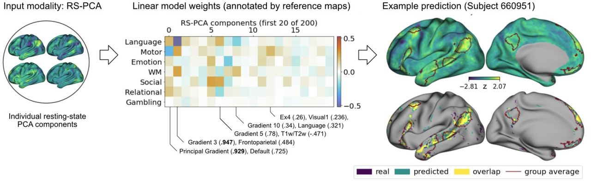

# Individual function predictions


[](https://www.biorxiv.org/content/10.1101/2024.11.13.621472v1.abstract)
[](https://www.biorxiv.org/content/10.1101/2024.11.13.621472v1.abstract)


This repository contains the code for the study **"Individual brain activity patterns during task are predicted by distinct resting-state networks that may reflect local neurobiological features"** \[[biorxiv](https://www.biorxiv.org/content/10.1101/2024.11.13.621472v1.abstract)\]



This manuscript describes a pipeline that allows for the prediction of individual brain acitvity patterns based on a range of feature modalities, and the analysis of which features are predictive of which function.

We use for example *functional connectivity* (both PCA/gradients and ICA components), *geometric measures* such as distances on the brain surface to sensory areas, *structural connecitvity* (i.e. DWI measures of fibre tracts), *cortical microstructure & morphology* (e.g. local cortical thickness). The relevant preprocessing is described separately [for each modality](#preprocessing).

You can **get started** by having a look at regression ([`linear_models.c.ipynb`](linear_models.c.ipynb)), and plotting notebooks ([`plot_overall_results.ipynb`](plot_overall_results.ipynb)).  An example of the full pipeline (from data download, to regression and scoring) can be found in [`cneuromod_validation.c.ipynb`](cneuromod_validation.c.ipynb). 

The resolution of output images in the notebooks was reduced to avoid large filesizes. 

For these predictions we use data from both the [Human Connectome Project](https://www.humanconnectome.org/study/hcp-young-adult/document/1200-subjects-data-release), and the [Curtois Project on Neural Modeling](https://docs.cneuromod.ca/en/latest/DATASETS.html#hcptrt).

If there seems to be something missing or you'd like to contribute, please open an issue.

### File descriptions

The code is structured into notebooks that span the different analysis stages:

| <div align="left"> Model fitting and analysis </div>          |  <div align="left"> Description    </div>                                                                                                                 |
| ------- | -------------------------------------------------------------------------------------------------------------------------------------------- |
| [linear_models.c.ipynb](linear_models.c.ipynb)                             | The full model fitting pipeline for all modalities, along with plotting of the main results                                                  |
| [linear_models_pca_ component_annotation.ipynb](linear_models_pca_component_annotation.ipynb)     | Annotation of the main RS-PCA components underlying the best performing model through correlation with known maps of brain organization. Creates: ***SupplTable 1***     |
| [linear_models_feature_ contributions_(pca).ipynb](linear_models_feature_contributions_(pca).ipynb)  | Alternative ways of assessing the importance of each RS-PCA component as feature in the linear model.                                        |       
| **Validation**                                     |                                                                                                                                              |     
| [replicate_on_right_hemisphere.ipynb](replicate_on_right_hemisphere.ipynb)            | Replication of the full model fitting pipeline based on data from the right hemisphere in the same subject (includes preparation & model fitting).  Creates: ***SupplFig 5***   | 
| `cneuromod_validation.c.ipynb`                    | Test of the generalizeability of the previously fitted linear model (based on HCP subjects) to a new dataset (CNeuroMod) + Replication of the full model fitting pipeline based on CNeuroMod data of 3 subjects  (includes download, task-contrast computation, preparation & model fitting).  Creates: ***SupplFig 6, 7*** |
| **Plotting**                                       |                                                                                                                 |
| `plot_overall_results.ipynb`                       | For plotting of the follwing figures: ***Figure 2,3e; SupplFig 1,2; SupplTable 1***                                                         | 
| `plot_per-parcel_model_results.ipynb`              | For plotting of the follwing figures: ***Figure 4; SupplFig 3***                                                                            |  
| `plot_rspca_indiv_predictions.ipynb`               | For plotting of the follwing figures: ***Figure 3c,d***                                                                                      | 
| `plot_rspca_component_weights_v2.ipynb`            | For plotting of the follwing figures: ***Figure 3b,5; SupplFig 4***                                                                          |

<br>

Thereby it is drawing in common functions that are defined in scripts located in the [`lib/`](lib) folder  :

* `lib/data_loading.py` - Some helper functions to load data, e.g. `load_xy_data`, `gather_modalities`
* `lib/linear_models.py` - Helper functions for model fitting and prediction, e.g. `predict_y_from_x, score`
* `lib/plotting.py` - Some custom plotting functions (as surfplot cannot be used on our current cluster as no x-server is available), e.g. `plot_bars`, `plot_29k`
* `lib/stats.py` - Functions to compute some statstics & scores, e.g. `compute_all_scores`, `comp_dice`, or `comp_corr`
<br>

# Preprocessing

Furthermore we provide the preprocessing scripts that transforms the data into the inputs required for the scripts above: 
<details> 
  <summary> <b>Download and preprocessing scripts</b> </summary>

| File            | Description                                                                                                                                  |
| ------- | -------------------------------------------------------------------------------------------------------------------------------------------- |
| <br>**Preparation**                                    | i.e. preprocessing nessesary for each of the predictors                                                                                      |
| `download_hcp_data.ipynb`                          | download resting brain surfaces, state runs, task maps and (freesurfer-derived) structural maps                                              | 
| `hcp_task_retest_baseline.ipynb`                   | Notebook to compute the test-retest baselines (accuracy, discriminability, vertex-wise-scores ...)                                           |
| `prepare_rs_gradients.ipynb`                       | Computation of resting-state functional connectivity components                                                                              |
| `prepare_rs_ica.ipynb`                             | Similiar process for the ICA components                                                                                                      |
| `prepare_distances.ipynb`                          | Computation of distances (vertex-to-parcels/landmarks) and PCA of the full vertex-to-vertex distance matrix                                  |
| `prepare_structural_eigenmodes.ipynb`              | Computation of the structural eigenmodes of the individual left-hemisphere cortical surfaces                                                 |
| `prepare_blueprints.ipynb`                         | This notebook loads individual blueprints (prev computed by FSL XTract) and concatenates them into a single file.                            |
| `prepare_task_maps_(pred target).ipynb`  <br>          | Concatenates task contrasts for each subject into a single file                                                                              |

</details>

<br>

# Resources and results

TBD: download to openneuro/figshare of big files. 
<details> 
  <summary> <b>Files to upload</b> </summary>

```txt
data/all_cortical_reference_maps_v2.fslr32k.l29.npy

results/scores/rs_pca.lin_weights.200.spatial_zscore.yfull.npy
data/group_conmat_pca.200c.pkl

Results (i.e. scores & information) + in extended version with individual task contrast predictions
results/scores/linear_regression_scores_and_info_v3.yfull.aa.npy
results/scores/linear_regression_scores_and_info_v3.yfull.aa.extended.npy

Results (i.e. scores & information) + in extended version with individual task contrast predictions
results/scores/within_parcel_models.lausanne.51test_subjs.47tasks.all_modalities.from_zscored.yfull.npy

Data saved for external plotting (Predictor and result subsets):
data/xdata_microstruc.51subj.test.yfull.npy
data/xdata_rspca.51subj.200comps.test.yfull.npy
results/scores/linear_regression_scores_and_info_v3.yfull.aa.extended.small.npy

results/retest_hcp40.test.mean_task_maps47.from_zscored.npy
results/retest_hcp40.task_maps47.zscored.npy

Full Task Retest baseline
results/scores/retest_hcp.40subjs.47tasks.retest_scores.from_zscored.npy

Full Task baseline when always predicting group averages
results/scores/retest_hcp.40subjs.47tasks.group_mean_scores.from_zscored.npy

Full Task Retest vw-accuracy baseline
results/scores/retest_hcp.40subjs.47tasks.vertexw_acc_across_subjs.from_zscored.npygroup_mean_scores.from_zscored.npy
```

</details> 

# Dependencies 

These scripts make wide usage of the following python libraries: 
`nibabel`, `nilearn`, `sklearn`, `surfplot`, `brainspace`, and `hcp_utils`. 

Some scripts contain references to commands for the transformation of surface brain data from the [connectome workbench toolbox](https://www.humanconnectome.org/software/connectome-workbench).


# Preprint & Citation

To cite this work, please use:

 ```bibtex
@article{scholz2024individual,
  title={Individual brain activity patterns during task are predicted by distinct resting-state networks that may reflect local neurobiological features},
  author={Scholz, Robert and Benn, R Austin Bruce and Shevchenko, Victoria and Klatzmann, Ulysse and Wei, Wei and Alberti, Francesco and Chiou, Rocco and Zhang, Xi-Han and Leech, Robert and Smallwood, Jonathan and others},
  journal={bioRxiv},
  pages={2024--11},
  year={2024},
  publisher={Cold Spring Harbor Laboratory}
}
```

This work was conducted as part of my doctoral research at the [Cognitive Neuroanatomy Lab](https://www.neuroconnlab.org/). 


